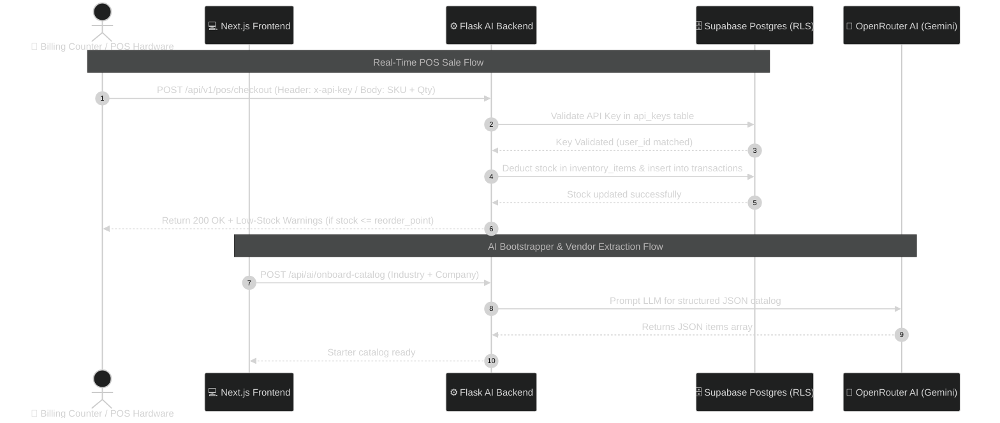
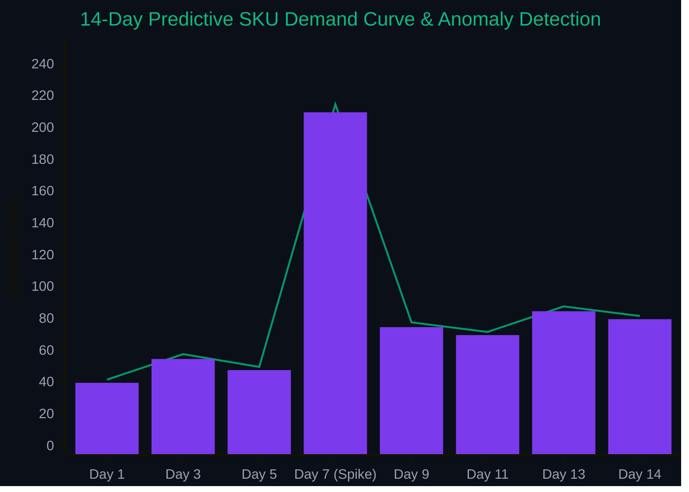

<div align="center">

<!-- Animated Typing Banner -->
<a href="https://github.com/veer/StockShift-AI">
  
</a>

<p align="center">
  <b>Enterprise-Grade Autonomous Inventory Intelligence & Real-Time POS Sync Platform</b>
</p>

<!-- Tech Badges -->
<p align="center">
  <a href="#-technology-stack">
    
    
    
    
    
    
  </a>
</p>

---

</div>

## 🌟 Feature Showcase

<table>
  <tr>
    <td width="50%" valign="top">
      <h3 align="center">🤖 <span style="color:#059669">AI Onboarding Bootstrapper</span></h3>
      <p>Select your industry (<i>Electronics, FMCG, Pharmacy, Fashion</i>) and company details. In one click, StockShiftAI generates 10–15 realistic starter inventory items with unit costs (INR ₹), sell prices, SKUs, and reorder points.</p>
    </td>
    <td width="50%" valign="top">
      <h3 align="center">🏢 <span style="color:#7C3AED">AI Vendor Auto-Discovery</span></h3>
      <p>Paste raw text from supplier invoices, emails, or WhatsApp chats. AI extracts vendor name, email, phone, lead times, MOQ, and SLA payment terms (e.g., <i>Net 30</i>) into structured fields in 2 seconds.</p>
    </td>
  </tr>
  <tr>
    <td width="50%" valign="top">
      <h3 align="center">🛒 <span style="color:#2563EB">Real-Time POS Store Terminal</span></h3>
      <p>Dedicated cashier checkout UI with instant SKU/barcode search, cart controls, real-time stock deduction, and automatic <b>Low-Stock Warning</b> triggers upon checkout.</p>
    </td>
    <td width="50%" valign="top">
      <h3 align="center">🔑 <span style="color:#D97706">Commercial API Key Engine</span></h3>
      <p>Generate secure <code>sk-pos-*</code> keys from Settings to connect local physical store billing counters and hardware. Every sale updates central inventory in real time.</p>
    </td>
  </tr>
  <tr>
    <td width="50%" valign="top">
      <h3 align="center">📄 <span style="color:#4F46E5">RAG Document Intelligence</span></h3>
      <p>Upload supplier contracts, invoices, and SOPs. Query your supply chain knowledge base in natural English (e.g., <i>"What are our payment terms with Apex Electronics?"</i>).</p>
    </td>
    <td width="50%" valign="top">
      <h3 align="center">🔮 <span style="color:#0D9488">Predictive Forecasting & Transfers</span></h3>
      <p>14-day LLM demand forecasting, safety stock calculation ($1.65 \times \sigma \times \sqrt{\text{lead\_time}}$), anomaly spike alerts, and inter-warehouse rebalancing transfer suggestions.</p>
    </td>
  </tr>
</table>

---

## 🔄 Real-Time System Flow



---

## 📈 Real-Time Demand Forecasting & AI Anomaly Spike Detection

<div align="center">



<table width="85%">
  <tr>
    <td align="center" bgcolor="#064E3B">
      <h4 style="color:#34D399; margin:4px 0;">⚡ Baseline Demand</h4>
      <p style="color:#A7F3D0; margin:2px 0; font-size:13px;"><b>45-55 units / day</b> (Normal Trend)</p>
    </td>
    <td align="center" bgcolor="#7F1D1D">
      <h4 style="color:#FCA5A5; margin:4px 0;">🚨 Anomaly Spike Detected</h4>
      <p style="color:#FECACA; margin:2px 0; font-size:13px;"><b>+320% Demand Surge</b> (Day 7 Alert)</p>
    </td>
    <td align="center" bgcolor="#312E81">
      <h4 style="color:#A5B4FC; margin:4px 0;">🛡️ Automated Reorder Trigger</h4>
      <p style="color:#C7D2FE; margin:2px 0; font-size:13px;"><b>Safety Stock + 85 units</b></p>
    </td>
  </tr>
</table>

</div>

---

## 🗓️ Development Phases & Milestones

<div align="center">

| Phase | Description | Key Modules | Status |
|:---:|---|---|:---:|
| **`Phase 1`** | **Core Architecture & Auth** | Supabase Auth, Profiles Sync, Row-Level Security (RLS) |  |
| **`Phase 2`** | **Admin Workspace & UI** | Responsive Sidebar, Natural Language AI Assistant Widget |  |
| **`Phase 3`** | **AI Onboarding Bootstrapper** | Industry Selection, Starter Catalog Generator, Fallback Presets |  |
| **`Phase 4`** | **AI Vendor Auto-Discovery** | Raw-text LLM Parsing, Vendor Directory & SLA Tracking |  |
| **`Phase 5`** | **POS Terminal & Hardware API** | Web POS Terminal (`/admin/pos-terminal`), API Key Engine (`api_keys` Table) |  |
| **`Phase 6`** | **Optimization & Document RAG** | Cost Optimization, Scenario Planning, Inter-Warehouse Transfers |  |

</div>

---

## 🛠️ Technology Stack

| Layer | Technology | Purpose |
|---|---|---|
| **Frontend** |   | Server & Client Components, React 18, Type Safety |
| **Styling & UI** |   | Modern Dark/Light Design Tokens, Lucide Icons |
| **Database & Security** |  | Row Level Security (RLS), Realtime Events, Auth Triggers |
| **AI Backend** |   | REST API Services, OpenRouter Client, In-Memory Caching |
| **AI LLM Models** |  | Multi-key Failover, Structured JSON Extraction, RAG Vector Context |

---

## 🚀 Local Quickstart Guide

### 1. Prerequisites
- **Node.js**: `v18.0+`
- **Python**: `v3.10+`
- **Supabase Account** & **OpenRouter API Key**

### 2. Installation
```bash
git clone https://github.com/veer/StockShift-AI.git
cd StockShift-AI

# Install frontend dependencies
npm install

# Install backend dependencies
cd backend
pip install -r requirements.txt
cd ..
```

### 3. Environment Configuration
Create a `.env.local` file in the root directory:
```env
NEXT_PUBLIC_SUPABASE_URL=https://your-project.supabase.co
NEXT_PUBLIC_SUPABASE_ANON_KEY=your-anon-key
NEXT_PUBLIC_AI_BACKEND_URL=http://localhost:5001

OPENROUTER_API_KEY=sk-or-v1-your-key
OPENROUTER_BACKUP_API_KEY=sk-or-v1-backup-key
```

### 4. Database Initialization
Execute [`supabase_schema.sql`](file:///Users/veer/Documents/Coding%20projects%20and%20files/inventory-platform/StockShift-AI/supabase_schema.sql) in your **Supabase SQL Editor**:
- Provisions `profiles`, `inventory_items`, `transactions`, `vendors`, `purchase_orders`, and `api_keys` tables with RLS policies.

### 5. Launch Application
```bash
# Terminal 1: Python AI Backend (Port 5001)
cd backend && python app.py

# Terminal 2: Next.js Frontend (Port 3000)
npm run dev
```
Open **[http://localhost:3000](http://localhost:3000)** in your browser.

---

## 📡 REST API Reference

### 🛒 `POST /api/v1/pos/checkout`
Process a retail point-of-sale checkout and deduct stock live.
- **Header**: `x-api-key: sk-pos-...`
- **Body**:
```json
{
  "items": [
    { "sku": "ELC-001", "quantity": 2 }
  ]
}
```
- **Response**:
```json
{
  "success": true,
  "results": [
    { "sku": "ELC-001", "name": "Wireless Earbuds", "status": "sold", "quantitySold": 2, "remainingStock": 43 }
  ],
  "lowStockAlerts": []
}
```

### 🤖 `POST /api/ai/onboard-catalog`
Generate a starter inventory catalog tailored to business industry.
- **Body**: `{ "industry": "Electronics & Gadgets", "companyName": "Apex Tech" }`

### 🏢 `POST /api/ai/parse-vendor`
Extract structured vendor properties from raw invoice/chat text.
- **Body**: `{ "text": "Raw invoice or vendor email content..." }`

---

## 📄 License
Distributed under the MIT License. See `LICENSE` for details.
